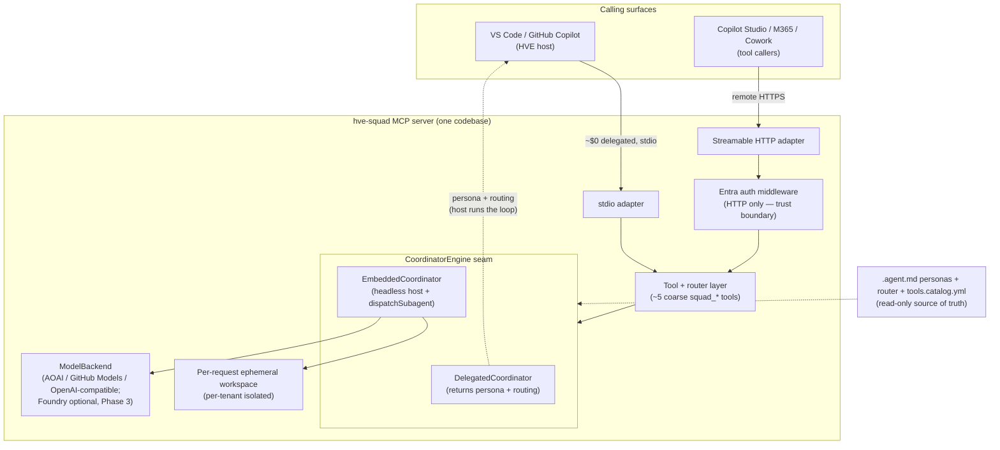

<!-- markdownlint-disable MD025 MD033 -->
---
id: "0001"
title: "Dual-mode MCP exposure: delegated (stdio) vs embedded (remote HTTP) execution for hve-squad"
status: "accepted"
date: "2026-06-29"
decision-makers:
  - "Squad Council (architect, security, cost-manager, product-owner)"
  - "hve-squad maintainers (@hve-squad/maintainers)"
deciders:
  - "Squad Council (architect, security, cost-manager, product-owner)"
  - "hve-squad maintainers (@hve-squad/maintainers)"
consulted:
  - "System Architecture Reviewer"
  - "Security Planner"
  - "Squad Cost Manager"
  - "GitHub Backlog Manager (product owner)"
informed:
  - "hve-squad package consumers"
  - "Phase 1 implementation team"
tags:
  - mcp
  - architecture
  - exposure
  - delegated-vs-embedded
  - tenant-isolation
  - security-trust-boundary
supersedes: null
superseded-by: null
related:
  - path: ".copilot-tracking/research/20260629-mcp-plugin-exposure-architecture.md"
    relation: influenced-by
    note: "Target architecture: §3 decision, §4 components, §5 headless invocation, §11 WAF/security, §15/§16 ADR recommendation."
  - path: ".copilot-tracking/squad/verdicts/mcp-plugin-exposure-phase1.md"
    relation: influenced-by
    note: "Council verdict: Stop under most-restrictive-wins, 0 blocking issues, 22 conditions (architect C1/C2, security 10, cost 5, product 5)."
  - path: ".copilot-tracking/plans/20260629-mcp-plugin-exposure-plan.md"
    relation: informational
    note: "Phase 1 implementation plan; this ADR is Gate B (Step 1.0b)."
asr_triggers:
  - kind: cost
    evidence: ".copilot-tracking/squad/verdicts/mcp-plugin-exposure-phase1.md (cost envelope ~$240-300/mo); architecture §11.3"
    note: "Delegated mode is ~$0 (caller's model runs inference); embedded server-side inference dominates Phase 1 cost. Drove the dual-mode split and scale-to-zero hosting."
  - kind: security
    evidence: "Council verdict security Risk: High with 10 conditions; architecture §11.1"
    note: "Remote /mcp introduces a multi-tenant trust boundary: audience-bound tokens, per-tenant isolation, downstream least-privilege, charter-injection containment, non-bypassable gates."
  - kind: scalability
    evidence: "Architect condition C2 (long-run under scale-to-zero); architecture §11.2/§11.5"
    note: "Long-running multi-agent fan-out over HTTP under scale-to-zero needs a durable, resumable run pattern with per-tenant rate and concurrency caps."
  - kind: evolvability
    evidence: "Additive-only constraint; ModelBackend abstraction; architecture §2.3/§9"
    note: "One CoordinatorEngine seam plus a pluggable ModelBackend keeps exposure additive and Foundry optional (Phase 3), so surfaces and backends evolve without forking personas."
---

# Dual-mode MCP exposure: delegated (stdio) vs embedded (remote HTTP) execution for hve-squad

## Context and Problem Statement

`hve-squad` is an APM package that exposes the Squad Coordinator and the ~200-member HVE Core cast outward as roughly five coarse MCP tools (`squad_research`, `squad_plan`, `squad_review`, `squad_architect`, `squad_run`). The reframing that forces this decision is that **an MCP server is a tool provider, not an agent host**: VS Code / GitHub Copilot is itself an HVE-aware host that can drive the squad's `user-invocable: false` subagent loop, whereas the cloud Copilot surfaces (Copilot Studio, M365 Copilot, Microsoft Cowork) are tool callers that cannot dispatch those subagents.

How should the package expose the squad so that it reaches both an HVE host and non-HVE cloud surfaces — additive-only, with no mandatory Azure AI Foundry — while preserving the Research → Plan → Implement → Review methodology and its Human Gates across a remote boundary?

Phase 0 (delegated execution over stdio for VS Code) is already built and shipped. Phase 1 (remote embedded execution) is gated by a squad council that returned **Stop under most-restrictive-wins** (security inherent Risk: High) with **zero blocking issues** and a unanimous proceed-with-conditions posture (22 conditions). This ADR is **Gate B**: it formalizes the load-bearing decision so Phase 1 can re-gate cleanly.

## Decision Drivers

* **Who hosts the agent loop** — VS Code is an HVE host that can run the squad loop; the three cloud surfaces are tool callers that cannot dispatch the squad's `user-invocable: false` HVE subagents.
* **Cost** — delegated execution pushes inference onto the caller's model (~$0 server marginal cost); embedded execution pays server-side inference (~$240–300/month estimated per the council cost envelope; never billed, estimate only).
* **Reach** — stdio reaches local VS Code only; remote Streamable HTTP is required to reach the cloud surfaces.
* **Additive-only footprint** — new files only; the manifest generator reads the existing `.agent.md` personas read-only; no edits to existing agents/prompts; no mandatory Foundry.
* **Methodology fidelity** — the council Implementation Gate, autopilot/autonomous Human Gates, consumption ledger, and notification approval contract must survive the remote boundary and **never auto-release**.
* **Security trust boundary** — a remote, less-supervised caller demands per-tenant isolation, least-privilege downstream authorization, and charter-injection containment (council security Risk: High).

## Considered Options

* **Option A — Delegated-only** (thin): MCP tools return coordinator context; the caller's host runs the loop.
* **Option B — Embedded-only** (thick): the server runs the agent loop for everyone, including VS Code.
* **Option C — Dual-mode behind one `CoordinatorEngine`** (chosen): delegated for VS Code/stdio (~$0), embedded for remote/HTTP; shared router, tool schema, and personas.

## Decision Outcome

Chosen option: **"Option C — dual-mode behind one `CoordinatorEngine`"**, because it is the only option that reaches both the HVE host (VS Code) and the three cloud surfaces while keeping local execution at ~$0, preserving a single source of truth (the same `.agent.md` personas, router, and tool schema drive both modes), and isolating the remote/embedded blast radius behind one seam. Option A cannot serve the cloud surfaces; Option B over-builds Phase 0 and pays server-side inference for local calls that VS Code can run for free.

The load-bearing axis is **delegated vs embedded execution**; the **stdio vs Streamable HTTP** transport choice is its corollary, selected by host capability, not the primary decision.

**Status is Accepted for the dual-mode direction** — Phase 0 already ships the delegated half (`DelegatedCoordinator` over stdio for VS Code). The **Phase 1 embedded half remains gated**: its implementation must not begin until the 22 council conditions are dispositioned and the topic re-gates to a non-`Stop` verdict (plan Steps 1.0a Gate A and 1.0b Gate B). Acceptance of this ADR satisfies Gate B; it does **not** by itself authorize Phase 1 implementation dispatch.

### Coupled sub-decisions (council conditions folded into this decision)

The council made its proceed-with-conditions posture contingent on three coupled sub-decisions that are load-bearing for the embedded half. They are part of **this** decision's consequences and are settled here so Phase 1 can re-gate against them.

1. **Tenant-isolated, resumable run-state model** (architect condition C1).
   * Run state is partitioned per tenant with no shared mutable state across tenants. The default is an **ephemeral per-request workspace** (no cross-call leakage); resumability is layered on top, per tenant, only where a use case demands continuity (for example a `squad_run` pipeline paused at a Human Gate).
   * State lives under **server-allocated paths the caller cannot influence**; `request`/`context` can neither name nor traverse to another tenant's state.
   * A paused run rehydrates deterministically and must survive scale-to-zero cold starts (ties to C2).

2. **Long-running execution pattern under scale-to-zero** (architect condition C2).
   * Multi-agent fan-out over HTTP makes `squad_run` long-running while the host scales to zero when idle (`minReplicas: 0`, ~5-minute idle) for ~$0 idle cost.
   * Pattern: a **durable run record plus resumable continuation** rather than holding one open synchronous connection across the whole pipeline; prefer streaming/progress responses and partial artifacts; a run paused at a Human Gate persists and resumes on the next call/approval, tolerating cold starts.
   * Per-dispatch timeouts, bounded retries, and idempotency for the `squad_run` pipeline; per-tenant rate and concurrency caps; a hard monthly cost ceiling (~$500/tenant to start) with alerts at 70/90/100%.

3. **Trust boundary, tenant isolation, and downstream authorization** (security).
   * The **trust boundary** sits at the remote `/mcp` HTTPS edge. Inside: the embedded engine and the per-request ephemeral workspace. Outside: the calling surface and its user. (stdio inherits the local user's trust and is out of this boundary.)
   * **AuthN/AuthZ:** audience-restricted Entra token validation (RFC 8707; no anonymous `/mcp`); per-tool authorization/scopes gating `squad_run`; transport hardening (HTTPS, strict Origin allow-list, bound unguessable session id).
   * **Tenant isolation:** server-controlled and verifiable — server-allocated ephemeral workspace paths with guaranteed teardown, no shared mutable state, and a cross-tenant leakage assertion as a test.
   * **Downstream authorization (confused-deputy control):** when the embedded engine calls downstream MCPs (ADO / Azure / GitHub), it authorizes against the **caller's tenant entitlements** with least privilege — not a single over-privileged server identity.
   * **Charter-injection containment:** `request`/`context` are treated as **data, never authority**; injected content cannot release a gate or elevate scope.
   * **Gate carry-through:** the squad gates (council Implementation Gate, autopilot/autonomous Human Gates, notification approval, consumption ledger) cross the boundary and **never auto-release**; verified by a non-bypassable-gate negative test.
   * **Default-deny destructive agency:** **no shell/process execution in Phase 1**; destructive squad actions (deploy, force-push, schema migration) require the Human Gate.
   * **Secrets hygiene:** managed identity plus Key Vault; model keys and downstream tokens are never embedded, logged, or surfaced.

### Architecture sketch

### Consequences

* Good, because one codebase reaches all four surfaces: VS Code stays ~$0 (delegated) and remote stays scale-to-zero (embedded).
* Good, because the same personas, router, and tool schema drive both modes — a single source of truth that keeps exposure additive and the package authoritative, with no fork.
* Good, because the `CoordinatorEngine` seam isolates the two principal risks (the unproven delegated-drive contract and the from-scratch embedded host), each with a documented fallback (native `/squad` prompt, or local embedded execution at higher cost).
* Good, because the methodology's gates are carried in `squad_run` and never auto-release, so a remote caller is no less safe than a local one.
* Bad, because the embedded headless host (`dispatchSubagent` plus bounded fan-out plus per-request state) is real net-new engineering and the principal technical risk and source of behavioral drift from the VS Code experience.
* Bad, because Phase 1 is the cost/footprint inflection — the package gains a hosted service, a model dependency, and per-call inference cost (~$240–300/month estimated).
* Bad, because the remote security surface is inherently High risk; tenant isolation, downstream least-privilege, and charter-injection containment are non-trivial and must be proven (negative tests, cross-tenant leakage assertions) before any Phase 1 code review.
* Neutral, because surface manifest formats (M365 / Copilot Studio / Cowork) are `[VERIFY]`-pending; only the generator's projection changes when those facts land, since the tool schema is authored once in `tools.catalog.yml`.
* Neutral, because Foundry remains one optional Phase-3 `ModelBackend`; the embedded engine binds to a `ModelBackend` abstraction, so there is no mandatory premium runtime.

### Confirmation

* **Gate A** — the squad council re-gates `mcp-plugin-exposure` to a non-`Stop` verdict in `decisions.md` after the 22 conditions are dispositioned (plan Step 1.0a).
* **Gate B** — this ADR (Step 1.0b) is accepted and records the trust boundary, tenant isolation, long-run execution model, and charter-injection containment strategy required before any Phase 1 code review.
* **Parity conformance** — a Phase 1 embedded-vs-delegated parity suite (10–15 scenarios; drift > 5% = rework) plus a prompt-injection / red-team corpus in Step 1.7 demonstrate methodology fidelity and gate carry-through.
* **Security negative tests** — audience-restricted token validation (no anonymous `/mcp`), per-tool authorization gating `squad_run`, a cross-tenant leakage assertion on ephemeral-workspace teardown, and default-deny destructive agency (no shell/process execution in Phase 1).
* **CI drift-fail** — the manifest generator fails the build on catalog↔cast disagreement.

## Pros and Cons of the Options

### Option A — Delegated-only

The MCP tools return the Coordinator persona, the matched routing row, and the framed request; the caller's host runs the agent loop (architecture §3.2, Option A).

* Good, because server marginal cost ≈ $0 (inference runs on the caller's model).
* Good, because it adds no infrastructure and keeps Phase 0 fully additive.
* Good, because it reuses the existing VS Code dispatch path (`runSubagent`) unchanged.
* Neutral, because for VS Code it adds model-invocability and schema validation, not new capability (the native `/squad` prompt already works there).
* Bad, because it cannot serve Copilot Studio / M365 / Cowork — those surfaces cannot dispatch the squad's `user-invocable: false` HVE subagents. Necessary but insufficient.

### Option B — Embedded-only

The server hosts a headless agent loop for every caller, including VS Code, dispatching the cast server-side against a `ModelBackend` (architecture §3.2, Option B).

* Good, because one execution path serves all four surfaces uniformly.
* Good, because behavior is centrally controlled server-side.
* Bad, because it pays server-side inference for local VS Code calls that the host can run for free — the highest-cost option.
* Bad, because it over-builds Phase 0, forcing the remote service and model dependency before VS Code needs them.
* Bad, because it discards the near-zero-cost delegated path that VS Code makes available.

### Option C — Dual-mode behind one `CoordinatorEngine` (chosen)

One transport-agnostic codebase with a `CoordinatorEngine` seam: `DelegatedCoordinator` for VS Code/stdio (~$0) and `EmbeddedCoordinator` for remote/HTTP; shared router, tool schema, and `.agent.md` personas (architecture §3.2–§3.3, Option C).

* Good, because it reaches all four surfaces while keeping local execution at ~$0 and remote at scale-to-zero.
* Good, because the same personas/router/schema drive both modes — single source of truth, additive, no fork.
* Good, because the seam isolates the two principal risks with documented fallbacks.
* Good, because methodology gates are carried in `squad_run` and never auto-release across the remote boundary.
* Neutral, because the transport split (stdio vs Streamable HTTP) is a corollary selected by host capability, not a separate decision.
* Bad, because the embedded headless host is real net-new engineering and the main source of behavioral drift; mitigated by shared personas plus conformance tests.
* Bad, because Phase 1 introduces a hosted service, a model dependency, per-call inference cost, and a High-risk remote security surface requiring the coupled sub-decisions above.

## More Information

* **Scope and constraints:** additive-only to the package (new files only; the generator reads existing `.agent.md` personas read-only); no mandatory Azure AI Foundry (it is one optional Phase-3 `ModelBackend`).
* **Phasing context:** Phase 0 (local stdio, delegated) is shipped at ~$0. Phase 1 (remote HTTP + Entra, embedded) is the cost/footprint inflection and the subject of the coupled sub-decisions. Phase 2 adds a GitHub Copilot CLI/SDK backend; Phase 3 adds the optional Foundry backend. Phases 2 and 3 are re-gated as their own decisions (the council flagged the shell-capable backend for a separate gate).
* **Re-gate note:** this ADR formalizes the load-bearing decision so the council can re-gate `mcp-plugin-exposure` cleanly. Accepting the dual-mode direction does not release the Phase 1 implementation gate; Gate A (non-`Stop` council verdict) and the dispositioning of all 22 conditions remain prerequisites to Phase 1 code review.
* **References:**
  * Target architecture — `.copilot-tracking/research/20260629-mcp-plugin-exposure-architecture.md` (§3 decision, §4 components, §5 headless invocation, §11 WAF/security, §15/§16 ADR recommendation).
  * Council verdict — `.copilot-tracking/squad/verdicts/mcp-plugin-exposure-phase1.md` (Stop under most-restrictive-wins; 0 blocking; 22 conditions).
  * Implementation plan — `.copilot-tracking/plans/20260629-mcp-plugin-exposure-plan.md` (Phase 1; this ADR is Gate B / Step 1.0b).

---

> [!CAUTION]
> **Disclaimer:** This agent is an assistive tool only. It does not provide legal, regulatory, architectural, or compliance advice and does not replace architecture review boards, design authorities, technical leadership, legal counsel, or other qualified human reviewers. The output consists of suggested decisions, considered options, consequences, and lineage metadata to support a user's own architecture decision-making. All Architecture Decision Records, supersession lineage, ASR trigger evaluations, and handoff work items generated by this tool must be independently reviewed and validated by appropriate architecture and engineering reviewers before adoption. Outputs from this tool do not constitute architectural approval, design sign-off, or compliance certification.

> Brought to you by microsoft/hve-core
