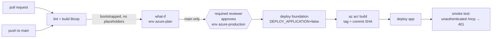

<!-- markdownlint-disable-file -->
# RUNBOOK — deploy the hve-squad MCP remote thin slice to YOUR Azure tenant

> **Automated.** Steps 1–7 run as code. A one-time bootstrap script gives CI an
> identity; from then on [`.github/workflows/azure-infra.yml`](../.github/workflows/azure-infra.yml)
> lints the Bicep and runs **what-if** automatically, then deploys to Azure only
> after a required reviewer **approves** it, authenticating as a **managed
> identity** through GitHub OIDC (no stored secret). Every deployment detail lives
> in [`host/infra/main.bicepparam`](infra/main.bicepparam). Each step below says
> what runs it and gives the manual equivalent for an operator without CI.
>
> **Fidelity claim (locked):** squad-guided / embedded — NOT "squad-executed". The
> squad runs server-side under its gates and methodology and returns a finished
> artifact; the calling agent is guided by the squad, it does not itself execute
> the cast.

This is the end-to-end sequence the connector README, `host/infra/main.bicep`, and
the connector generator all point at. It stands up the scale-to-zero Azure
Container Apps (ACA) app that serves the Streamable HTTP `/mcp` endpoint with
Entra authentication and managed-identity secrets, then imports the generated
Copilot Studio connector.

The remote surface exposes six tools: four **synchronous advisory tools**
`squad_research`, `squad_review`, `squad_plan`, and `squad_architect` (each runs a
single-stage embedded advisory dispatch and lands no impactful action), plus the
gated **async advisory pipeline** `squad_run` and the `squad_status` poll utility.
`squad_run` is exposed but **safe by construction** — it returns a run id and holds
at the Human Gate, never auto-releasing; `squad_status` advances the run only after
an out-of-band approval.

## What runs each step

| Step | What | Runs as |
| --- | --- | --- |
| 1 | CI identities (plan + deploy), OIDC federation, RBAC, providers, GitHub environments | `host/infra/bootstrap/Initialize-AzureCicd.ps1` — **once**, by an operator |
| 2 | Entra app registration, scopes, `Squad.Operate` app role | the same bootstrap script |
| 3 | Azure OpenAI account + model deployment | `modules/openai.bicep`, via the workflow |
| 4 | Deployment parameters | `host/infra/main.bicepparam` — you edit and commit it |
| 5 | Container registry + image build | `modules/container-registry.bicep` + `az acr build`, via the workflow |
| 6 | Container App, environment, Key Vault, identity, storage, budget | `host/infra/main.bicep` and its modules, via the workflow |
| 7 | App identity → **Cognitive Services OpenAI User**, plus a smoke test | `modules/openai.bicep` + the workflow's smoke test |
| 8 | Import the connector into Copilot Studio | manual (a Copilot Studio action; no API) |

### Layout

```text
host/infra/
  main.bicep                    orchestrator: composes config, calls one module per resource
  main.bicepparam               EVERY deployment value
  bicepconfig.json              linter rules (security rules are errors)
  modules/
    managed-identity.bicep      app identity
    log-analytics.bicep         logs
    key-vault.bicep             Key Vault + Secrets User for the app identity
    container-registry.bicep    ACR + AcrPull for the app identity
    openai.bicep                Azure OpenAI + model + OpenAI User for the app identity
    storage.bicep               tables / blob containers + data roles (optional features)
    container-apps-environment.bicep
    container-app.bicep         the /mcp app + built-in Entra auth
    worker-job.bicep            the optional run-worker ACA Job
    budget.bicep                70 / 90 / 100% budget alerts
  bootstrap/
    main.bicep / main.bicepparam  one-time: resource groups, plan + deploy identities, federation, RBAC
    modules/github-identity.bicep
    modules/plan-rbac.bicep       read + what-if custom role
    modules/deploy-rbac.bicep     Contributor + constrained RBAC Administrator
    Initialize-AzureCicd.ps1      runs the bootstrap + Entra app + GitHub environments
  graph-memory-permissions.bicep  tenant-admin grant for the graph memory backend (manual)
```

### The pipeline



- **Lint** runs on every pull request and push touching the hosting: `az bicep lint`
  and `az bicep build` for every template, `az bicep build-params` for every
  parameter file (type-checking it against its template). It needs no Azure access.
- **What-if** runs after lint once the bootstrap has set the `AZURE_*` variables and
  `main.bicepparam` has no `<PLACEHOLDER>` left; until then it is skipped, not
  failed. The full what-if lands in the job summary and as an artifact.
- **Deploy** runs on `main` only, after what-if succeeds, and waits for a reviewer
  of the `azure-production` environment. It is two-phase: the foundation first, so
  the registry exists and the app identity already holds `AcrPull` when the image is
  built; then the app on the image tagged with the commit SHA.

## Where real (small) spend begins

| Stage | Resource | Spend |
| --- | --- | --- |
| Steps 1–2 | Resource groups, deploy identity, OIDC federation, RBAC, Entra app | **$0** (identity is free) |
| Step 3 | Azure OpenAI account + model deployment | **Real, usage-based** — billed per token at inference time |
| Step 5 | ACR registry + `az acr build` | **Real, small** — Basic registry, ACR Tasks build minutes + image storage |
| Step 6 | ACA managed environment, Log Analytics, Key Vault | **Real, small** — Log Analytics ingestion + Key Vault ops; **ACA idle compute ≈ $0** thanks to `minReplicas: 0` (COST-3 / ARCH-2) |
| Step 7+ | First `/mcp` calls | **Real** — AOAI inference per embedded run, bounded by the per-tenant monthly ceiling (COST-2) and concurrency cap (SEC-9 / COST-1) |

The deployment also provisions a **monthly budget with 70 / 90 / 100% alerts**
(COST-2). Set `budgetAmountUsd` and `budgetAlertEmails` so you are notified before
spend grows. The first deploy is the first spend: it happens only after approval.

## Prerequisites

- An Azure subscription where you can create resource groups, register resource
  providers, create custom roles, and assign roles (Owner, or Contributor + User
  Access Administrator) — needed once, for the bootstrap.
- Permission to **register an Entra application** in your tenant (Application
  Developer or higher) — also only for the bootstrap.
- Admin rights on the GitHub repository (to create environments and variables).
- The Azure CLI (`az`) with Bicep (`az bicep install`), the GitHub CLI (`gh`), and
  PowerShell 7 — on the operator's machine, for the bootstrap only.
- Access to **Microsoft Copilot Studio** in the same tenant, with permission to
  create custom connectors and enable generative orchestration.
- Local Docker is **not** required: the image is built in ACR.

## Step 1 — bootstrap the deploy identity (once)

Review [`host/infra/bootstrap/main.bicepparam`](infra/bootstrap/main.bicepparam) —
region, the two resource group names, the deploy identity name, and the GitHub
repository — then run, signed in with `az login` and `gh auth login`:

```powershell
./host/infra/bootstrap/Initialize-AzureCicd.ps1 -SubscriptionId <SUBSCRIPTION_ID>
# -Reviewers alice,bob   production approvers (default: you)
# -WhatIf                show what it would do
```

It deploys `bootstrap/main.bicep` (subscription scope), which creates:

- the **workload resource group** `main.bicep` deploys into;
- a separate **CI/CD resource group** holding the two CI **user-assigned managed
  identities**, so tearing the workload down never deletes the identities that
  redeploy it;
- a **plan identity** federated **only** to `repo:<owner>/<repo>:environment:azure-plan`,
  holding a custom role on the workload resource group that can **read and run
  what-if but cannot create, modify, or delete** anything;
- a **deploy identity** federated **only** to
  `repo:<owner>/<repo>:environment:azure-production`, holding — on the **workload
  resource group only** — `Contributor`, and `Role Based Access Control
  Administrator` **constrained by an ABAC condition** to the five data-plane roles
  `main.bicep` grants the app identity (Key Vault Secrets User, Storage Table/Blob
  Data Contributor, AcrPull, Cognitive Services OpenAI User). It cannot grant Owner
  or any other role.

Before deploying, it registers the resource providers `main.bicep` uses
(`Microsoft.App`, `Microsoft.CognitiveServices`, `Microsoft.ContainerRegistry`, …):
the CI identities hold resource-group roles only, so ARM cannot auto-register a
provider on their behalf.

No client secret exists for either identity.

It then configures GitHub:

- environment **`azure-plan`** (no reviewers) for what-if;
- environment **`azure-production`** with **required reviewers** and a deployment
  branch policy of `main` only — the approval gate;
- repository variables `AZURE_PLAN_CLIENT_ID`, `AZURE_CLIENT_ID`, `AZURE_TENANT_ID`,
  `AZURE_SUBSCRIPTION_ID`, and `AZURE_RESOURCE_GROUP`.

Re-running the script converges; it never duplicates.

> The **CI** identities are separate from the **app's** managed identity created in
> Step 6. The app identity is what calls Azure OpenAI at runtime (Step 7).

> **Why two CI identities.** What-if runs automatically, including on pull requests
> whose workflow file a collaborator controls. It therefore signs in as the plan
> identity, which cannot deploy anything. The only identity that can change Azure is
> reachable only from `azure-production`, which accepts `main` alone and waits for a
> required reviewer — so no edit to the workflow can deploy without approval. Fork
> pull requests get no OIDC token and stop at lint.
>
> What-if runs template validation, whose *linked access checks* can ask for a
> `join` / `assign` action on a resource id referenced by another resource
> (Azure/arm-template-whatif#135). The plan role carries the ones `main.bicep`
> needs; if a future template change makes what-if report `AuthorizationFailed` for
> another such action, add it to `planActions` in
> `host/infra/bootstrap/modules/plan-rbac.bicep` and re-run the bootstrap.

## Step 2 — register the Entra app and expose the API (SEC-1 / SEC-2)

**Automated by the bootstrap script**, idempotently: it creates (or updates) the app
registration `hve-squad MCP`, sets its Application ID URI to `api://<appId>` — the
token **audience** the server enforces (RFC 8707) — requests **v2** access tokens
(the server trusts the v2 issuer), adds every delegated scope below, adds the
`Squad.Operate` app role, and creates its service principal. Existing scope and role
ids are preserved, so consent grants survive a re-run. It then writes the tenant id
and the app's client id into `main.bicepparam`.

| Scope | Grants |
| --- | --- |
| `Squad.Research` | invoke `squad_research` |
| `Squad.Plan` | invoke `squad_plan` |
| `Squad.Review` | invoke `squad_review` |
| `Squad.Architect` | invoke `squad_architect` |
| `Squad.Run` | invoke `squad_run` and poll `squad_status` |
| `Squad.Federate` | invoke `squad_federate` (the federation meta layer) |
| `Squad.Render` | invoke `squad_render_pptx` |
| `Squad.Memory` / `Squad.MemoryWrite` | read / write squad memory and `squad_history` |
| `Squad.Business` / `Squad.Backlog` | invoke `squad_business_plan` / `squad_backlog` |

The `Squad.Operate` app role is separate: it authorizes the out-of-band operator
approval route (`POST /admin/approve`) and is granted as an Entra **app role**, not
a delegated connector scope.

`Squad.Federate` is deliberately distinct from `Squad.Run`: authorization to run
one squad is not authorization to drive a whole federation. `squad_federate` is a
gated catch-all like `squad_run` — it is served only when
`SQUAD_MCP_REMOTE_PIPELINE_ENABLED=true`, holds at the Human Gate, and is released
by the same out-of-band `/admin/approve` route. Every scope is fail-closed: a
missing scope returns 403 with no work performed.

Notes:

- The **audience** is `api://<appId>`. `main.bicepparam` derives `squad.audience`,
  the issuer, the JWKS URI, and the ACA auth client id from the two values the
  script fills in, so they cannot drift apart. Keep the connector's
  `apiProperties.json` consistent with them (Step 8).
- If Copilot Studio's first-party connector needs pre-authorization, add it under
  **Expose an API → Authorized client applications**.
- Skip this step with `-SkipEntraApp` to use an app registration you manage
  yourself; then fill `entraTenantId` and `apiClientId` in `main.bicepparam` by hand.

## Step 3 — Azure OpenAI (real spend begins) (SEC-3)

**Declared in Bicep** (`modules/openai.bicep`), configured by the `openAi` object in
`main.bicepparam`:

```bicep
param openAi = {
  create: true               // false = reuse an existing account of `name` in the workload RG
  name: 'squadmcp-aoai'      // globally unique custom subdomain
  // location: 'swedencentral'  // when the model is not offered in the RG region
  deploymentName: 'gpt-4o'
  modelName: 'gpt-4o'
  modelVersion: '2024-11-20'
  skuName: 'GlobalStandard'
  capacity: 10
  apiVersion: '2024-10-21'
}
```

A created account has **key authentication disabled** (`disableLocalAuth: true`):
the only way in is Entra, which is what SEC-10 asks for. The server's model
endpoint **and** its allow-list (SEC-3) are both derived from this account, so the
endpoint is never taken from a caller and the two can never disagree. Inference is
billed per token from here on.

## Step 4 — fill in the deployment parameters

Edit [host/infra/main.bicepparam](infra/main.bicepparam) and replace every remaining
`<PLACEHOLDER>` (after the bootstrap only `budgetAlertEmails` is left), then commit.
Every value is **operator-controlled** and never caller-influenced. The workflow
refuses to run what-if or deploy while a placeholder remains.

```bicep
var entraTenantId = '<ENTRA_TENANT_ID>'   // filled by the bootstrap
var apiClientId = '<ENTRA_CLIENT_ID>'     // filled by the bootstrap (Step 2)

param squad = {
  audience: 'api://${apiClientId}'
  allowedOrigins: 'https://copilotstudio.microsoft.com'   // SEC-8: strict, never '*'
  allowedIssuers: entraIssuer
  allowedTenants: entraTenantId
  jwksUri: 'https://login.microsoftonline.com/${entraTenantId}/discovery/v2.0/keys'
  tenantConcurrency: 4      // SEC-9 / COST-1
  tenantCostCeilingUsd: 500 // COST-2 (hard per-tenant monthly ceiling)
}

param budgetAmountUsd = 500
param budgetStartDate = '2026-10-01'   // a NEW budget must start this month or later
param budgetAlertEmails = [ '<ALERT_EMAIL>' ]
```

These map 1:1 to the server's environment contract (`SQUAD_MCP_AUDIENCE`,
`SQUAD_MCP_ALLOWED_ORIGINS`, `SQUAD_MCP_JWKS_URI`, `SQUAD_MCP_MODEL_ENDPOINT`, …);
the Container App sets them for you. No secret belongs in this file. Three values
are read from the environment instead of being written down:

| Environment variable | Parameter | Set by |
| --- | --- | --- |
| `CONTAINER_IMAGE_TAG` | `containerImageTag` | the workflow (commit SHA); default `latest` |
| `DEPLOY_APPLICATION` | `deployApplication` | the workflow (`false` for phase 1); default `true` |
| `SQUAD_MCP_RUN_ENCRYPTION_KEY_B64` | `runEncryptionKeyBase64` | the optional GitHub secret of that name |

## Steps 5–7 — build, deploy, grant, smoke-test (the workflow)

Push the committed parameter file to `main` (or run the workflow manually). After
lint and what-if, the **Deploy** job waits for approval in `azure-production`, then:

1. **Foundation** — `az deployment group create` with `DEPLOY_APPLICATION=false`:
   the app managed identity, Log Analytics, Key Vault (+ Secrets User), the **container
   registry** (+ AcrPull for the app identity), **Azure OpenAI** (+ **Cognitive
   Services OpenAI User** for the app identity — the old Step 7), storage when an
   optional feature needs it, the ACA environment, and the budget.
2. **Image** — `az acr build --file host/Containerfile .` into that registry, tagged
   with the commit SHA. The multi-stage build runs `npm run build` and ships only
   `dist/`, `tools.catalog.yml`, and `generated/`; no secret is baked in (SEC-10).
3. **Application** — the same deployment with `DEPLOY_APPLICATION=true`: the
   scale-to-zero Container App (`minReplicas: 0`, HTTPS-only ingress on port 3000;
   COST-3 / ARCH-2 / SEC-8) with **ACA built-in Entra auth** in front of the app's
   own audience-bound validation (SEC-1), and the worker job when enabled.
4. **Smoke test** — an unauthenticated `initialize` against `https://<fqdn>/mcp`
   must return **401**: ingress, TLS, and the auth layer are live. The job summary
   lists every deployment output, and the environment links to the endpoint.

### Migrating a deployment made with the old manual runbook

The template now owns three things the manual runbook did by hand. Before the first
pipeline deploy into a resource group that already runs the app:

- **Azure OpenAI grant.** The old Step 7 created the app identity's `Cognitive
  Services OpenAI User` assignment with a random name; the template declares the
  same assignment under a deterministic one, and ARM rejects the duplicate with
  `RoleAssignmentExists`. Delete the manual one first:

  ```bash
  az role assignment delete \
    --assignee "<appPrincipalId>" \
    --role "Cognitive Services OpenAI User" \
    --scope "$(az cognitiveservices account show -n <AOAI_RESOURCE> -g "$RESOURCE_GROUP" --query id -o tsv)"
  ```

- **Azure OpenAI account.** Point `openAi.name` at the existing account and set
  `create: false` to keep its deployment untouched, or `create: true` to let the
  template manage it (it then disables key auth on it).
- **Container registry.** The template creates its own registry and the app pulls
  from it; the previous registry is no longer referenced and can be deleted.

The Key Vault and Storage role assignments keep the names the single-file template
gave them, so they re-apply cleanly.

### Manual equivalent (no CI)

```bash
RESOURCE_GROUP="<RESOURCE_GROUP>"
cd <repo root>

# 1. Foundation
DEPLOY_APPLICATION=false az deployment group create \
  --resource-group "$RESOURCE_GROUP" --name hve-squad-mcp-foundation \
  --parameters host/infra/main.bicepparam

REGISTRY=$(az deployment group show -g "$RESOURCE_GROUP" -n hve-squad-mcp-foundation \
  --query properties.outputs.containerRegistryName.value -o tsv)

# 2. Image
TAG=$(git rev-parse HEAD)
az acr build --registry "$REGISTRY" --image "hve-squad-mcp:$TAG" --file host/Containerfile .

# 3. Application
CONTAINER_IMAGE_TAG="$TAG" az deployment group create \
  --resource-group "$RESOURCE_GROUP" --name hve-squad-mcp \
  --parameters host/infra/main.bicepparam
```

Capture the outputs:

```bash
az deployment group show \
  --resource-group "$RESOURCE_GROUP" \
  --name hve-squad-mcp \
  --query "properties.outputs.{fqdn:mcpFqdn.value, principal:appPrincipalId.value, kv:keyVaultName.value, model:modelEndpoint.value}"
```

- `mcpFqdn` — the HTTPS FQDN of your `/mcp` endpoint.
- `appPrincipalId` — the app managed-identity principal id (already granted
  Cognitive Services OpenAI User).
- `keyVaultName` — the Key Vault for any operator secrets.
- `modelEndpoint` — the Azure OpenAI endpoint the server calls and allow-lists.

### Authenticated smoke test (optional, manual)

The workflow proves an unauthenticated call is rejected. To prove an authenticated
handshake, use a token whose audience is the resource server. `initialize` does not
require a scope; a `tools/call` does (Step 8 validates that end to end):

```bash
TOKEN=$(az account get-access-token --resource "api://<ENTRA_CLIENT_ID>" --query accessToken -o tsv)

curl -sS "https://<mcpFqdn>/mcp" \
  -X POST \
  -H "Authorization: Bearer $TOKEN" \
  -H "Origin: https://copilotstudio.microsoft.com" \
  -H "Content-Type: application/json" \
  -d '{"jsonrpc":"2.0","id":1,"method":"initialize","params":{}}'
```

A successful response returns `serverInfo.name = hve-squad-mcp` and an
`Mcp-Session-Id` header. A `401` means the token audience/issuer is not accepted;
a `403 origin_not_allowed` means the `Origin` is not on the allow-list.

## Step 8 — import the connector into Copilot Studio (PROD-1)

The connector files are generated under
`generated/copilot-studio-connector/` (regenerate with
`npm run generate:connector`; do not edit by hand).

1. In `apiDefinition.swagger.json` and `apiProperties.json`, replace:
   - `<SQUAD_MCP_HOST>` → your `mcpFqdn` from Step 6 (host only, no scheme),
   - `<ENTRA_TENANT_ID>` → your tenant id,
   - `<ENTRA_CLIENT_ID>` → the `APP_ID` from Step 2,
   - `<SQUAD_MCP_AUDIENCE>` → `api://<ENTRA_CLIENT_ID>`.
2. In **Copilot Studio**, add a **custom connector** from the OpenAPI file (or use
   the MCP onboarding wizard). The connector advertises the
   `x-ms-agentic-protocol: mcp-streamable-1.0` `/mcp` operation and the four
   remotely-exposed tools (`squad_research`, `squad_review`, `squad_run`,
   `squad_status`).
3. Complete the **Entra OAuth 2.0** connection, consenting to the `Squad.Research`,
   `Squad.Review`, and `Squad.Run` scopes from Step 2.
4. **Enable generative orchestration** on the agent so it can call the MCP tools.
5. Test the synchronous path: ask the agent to "research X with the squad". The
   call should reach `/mcp`, the server runs the hero tool server-side under its
   gates, and returns a `squad-guided / embedded` artifact.
6. Test the async pipeline: ask the agent to "run the full squad on X". `squad_run`
   returns a **run id** and pauses at the Human Gate; after an out-of-band
   operator approval (below), a `squad_status` poll with that run id advances the
   run and returns the finished artifact. The gate never auto-releases across the
   remote boundary.

### Releasing a held run (operator action)

A held `squad_run` is released ONLY by an operator, out-of-band, through the admin
route — never by the caller or the model (SEC-6):

- Grant the human/service operator the distinct **`Squad.Operate`** app role (NOT
  `Squad.Run`). Only this role may approve; a caller that can start or poll a run
  cannot release one.
- Release a run with an authenticated `POST /admin/approve`:

  ```bash
  curl -sS -X POST "https://$FQDN/admin/approve" \
    -H "Authorization: Bearer $OPERATOR_TOKEN" \
    -H "Content-Type: application/json" \
    -d '{"runId":"<run-id-from-squad_run>"}'
  # 200 {"approved":true,"runId":"...","approver":"<operator>","at":<epoch-ms>}
  ```

  The release is **tenant-scoped** (an operator can release only runs in their own
  tenant; a cross-tenant or unknown run id returns 404 with no leakage) and
  **auditable** (approver + timestamp are recorded and emitted to the scrubbed
  audit log). The route is served only when the pipeline is enabled
  (`SQUAD_MCP_REMOTE_PIPELINE_ENABLED=true`); otherwise it returns 404. It is NOT
  an MCP tool and is not advertised in the connector.

### Enabling the pipeline: single-replica vs multi-replica + worker

The async pipeline has two run-state backends, selected by `SQUAD_MCP_RUN_STATE_BACKEND`:

- **`file`** (default) — a local directory (`SQUAD_MCP_RUN_STATE_DIR`). Durable across
  restarts but **single-replica**: an approval recorded on one replica is not visible
  to others. Keep `minReplicas`/`maxReplicas` at 1 for this backend.
- **`table`** — **Azure Table Storage**, the cross-replica backend (WI-06). Run records
  are partitioned by tenant; a held→running transition uses an ETag `If-Match`
  compare-and-swap, so exactly one replica drives a run. Approval is stored ON the run
  record, so `POST /admin/approve` on any replica releases the run for all. This is the
  backend for a **multi-replica / scale-to-zero** deployment.

Deploy the pipeline (Table backend) by setting these in `main.bicepparam`:

```bicep
param enableRemotePipeline = true   // creates the Storage account + table + RBAC, sets SQUAD_MCP_* env
param enableWorker = true           // deploys the worker ACA Job (below)
```

To AES-256-GCM encrypt request/context at rest (MEDIUM-3), store a base64 32-byte
key as the `SQUAD_MCP_RUN_ENCRYPTION_KEY_B64` GitHub secret; the parameter file
reads it into `runEncryptionKeyBase64`, so the key is never committed:

```bash
openssl rand -base64 32 | gh secret set SQUAD_MCP_RUN_ENCRYPTION_KEY_B64
```

The app's managed identity is granted **Storage Table Data Contributor** on the account;
no connection string or key is used (managed identity only, SEC-10).

**Long runs (>240s) — the worker.** The Azure Container Apps HTTP ingress hard-caps a
request at 240s, so a minutes-long pipeline cannot ride one `squad_status` poll. With
`SQUAD_MCP_WORKER_ENABLED=true` (which requires the `table` backend) the status poll
becomes **read-only** and a scheduled **worker ACA Job** (`<prefix>-worker`, default every
5 minutes) drains approved runs off the request path. The worker shares the app image
(`node dist/src/worker-main.js`), the same managed identity, and the same Table store; it
only ever picks up runs the store reports claimable (an approved held run, or a `running`
run whose lease lapsed) and CAS-claims each first, so the gate stays non-bypassable and two
workers never double-execute a run.

### Optional: the deterministic PowerPoint render tool (`squad_render_pptx`)

`squad_render_pptx` is a deterministic FILE-OUTPUT tool: it renders caller-supplied
deck content YAML to a `.pptx` with `python-pptx` and returns a short-lived
**download link**. It is OFF by default and independent of the async pipeline.

Enable it by setting `enableRenderPptx=true` in `main.bicep`. That provisions (behind
the flag) a **private Blob container** (`renders`, public access disabled) on the same
Storage account and grants the app identity **Storage Blob Data Contributor** — the role
that also allows minting a **user-delegation SAS** (`generateUserDelegationKey/action`).
The Storage account deploys when EITHER the async pipeline OR render is enabled.

How it works and what is safe by construction:

- The container image installs Python 3.11 + `python-pptx` (build-only; no LibreOffice
  or poppler — those back the export/validate actions the tool never runs). The build
  scripts are snapshotted into the image by `npm run snapshot:render`.
- The caller sends `contentYaml` (a document with a top-level `slides:` array) and
  `styleYaml`. The server renders in a **bounded ephemeral workspace** that is always
  cleaned up, writes only data files (never an executable `content-extra.py`), and never
  passes `--allow-scripts` — so caller YAML is DATA, never code (SEC-5).
- The deck is uploaded to `renders/<tenantId>/<uuid>/deck.pptx` (tenant-scoped,
  non-guessable) and the caller receives a **user-delegation SAS** link that expires in
  `renderSasTtlMinutes` (default 60). The SAS is a read-only, per-blob capability; it is
  registered as a secret and **never logged** (SEC-10).
- Grant callers the least-privilege **`Squad.Render`** scope. Missing the scope fails
  closed (403, no render work).

Optional branding: set `renderBrandTemplatePath` to a `.pptx` baked into the image to
brand every deck; absent, the render uses the skill default look and says so in the result.

### Optional: automatic squad memory (`SQUAD_MCP_MEMORY_AUTO_ENABLED`)

The memory broker (`SQUAD_MCP_ENABLE_MEMORY=true`, `enableMemory=true` in
`main.bicepparam`) exposes memory as tools the agent must choose to call. Under
Copilot Studio's generative orchestration that is unreliable: the agent may skip the
call, and it invents a different `project` name each session, so continuity silently
disappears.

Set `SQUAD_MCP_MEMORY_AUTO_ENABLED=true` (`enableMemoryAuto=true` in
`main.bicepparam`) to make continuity a SERVER behavior instead:

- before each embedded dispatch the server reads the resolved project's `state` and
  `decisions` and injects them as **delimited DATA** — never authority, so memory can
  never act as instructions (SEC-5);
- after a completed dispatch it writes the artifact to `history/<toolId>-<runId>` and
  appends a digest line to `state` under compare-and-swap with a bounded retry.

The partition is derived from a pinned federation sub-squad, else
`SQUAD_MCP_MEMORY_DEFAULT_PROJECT` (default `default`, lower-kebab-case). It is never
taken from caller free text. Requires `SQUAD_MCP_ENABLE_MEMORY=true`; boot fails fast
otherwise. When this is on, tell your Copilot Studio agent **not** to call the memory
tools (remove the memory section from the generated agent instructions).

### Optional: persist the squad ledger (`SQUAD_MCP_ENABLE_ARTIFACTS`)

Auto-memory keeps three flat keys. That is continuity between two turns and nothing
an operator can audit — you cannot open the PRD a run produced, or see which agent
wrote what.

Set `enableArtifacts=true` in `main.bicepparam` (requires `enableMemory` and
`enableMemoryAuto`) and a run additionally writes a browsable `.copilot-tracking`
tree:

- `squad/team.md`, `squad/routing.md`, `squad/state.json` seeded on first use;
- `squad/decisions.md` and `squad/notifications.md`, append-only;
- `squad/history/<agent>.md` per agent and `squad/history/autopilot-run-<id>.md`
  per run, each carrying a measured `#### Consumption` block;
- `squad/consumption.md`, rebuilt from those blocks so earlier turns are never
  dropped;
- each role's deliverable under its roster Deliverable Root — `research/<date>/`,
  `plans/`, `reviews/`, `ppt/<date>/<slug>/`, `docs/`, `outputs/`.

It writes through the store `memoryBackend` already selected, so the destination is
chosen once: `table` for Azure Table, `graph` for a SharePoint library your users can
open directly, `file` for a single replica. The `squad_history` tool reads the tree
back (`op=index` to summarize, `op=list` to enumerate, `op=read` to open one file),
and the run index is injected into each new run as DATA so a follow-up turn resumes
from what the project already holds.

### Optional: let advisory runs proceed unattended (`SQUAD_MCP_ADVISORY_AUTOPILOT_ENABLED`)

`squad_run` holds for an out-of-band approval at `/admin/approve`. A Copilot Studio
agent cannot reach that endpoint, so without this setting every `product` run holds
forever waiting for a human who is not in that loop.

Set `enableAdvisoryAutopilot=true` (requires `enableRemotePipeline`) and the server
releases the hold **only** for a run it has itself determined to be advisory-only —
one whose seeded roster produces text into the tracking tree and touches nothing
else. It is a narrowing of the gate, not an override:

- a run flagged destructive still holds;
- any roster seeding `backlog-executor`, `deployer`, `iac-author` or
  `azure-diagnose` still holds, so `azure`, `operations` and `full` are unaffected;
- `mode=autopilot` alone still releases nothing;
- the determination comes from the server-resolved roster, never from `request`,
  `context`, or model output.

Leave it off if you want every pipeline run reviewed by an operator first.

### Optional: persist memory to SharePoint or OneDrive (`SQUAD_MCP_MEMORY_BACKEND=graph`)

Set `enableMemory=true` and `memoryBackend='graph'` in `main.bicepparam`, plus
`memoryGraphDriveId`. The template projects these environment variables:

| Variable | `main.bicep` parameter | Meaning |
| --- | --- | --- |
| `SQUAD_MCP_MEMORY_BACKEND=graph` | `memoryBackend` | Persist memory through Microsoft Graph instead of Azure Table / local disk. |
| `SQUAD_MCP_MEMORY_GRAPH_DRIVE_ID` | `memoryGraphDriveId` | The target document library's drive id (or a OneDrive drive). Required. |
| `SQUAD_MCP_MEMORY_GRAPH_ROOT_PATH` | `memoryGraphRootPath` | Folder within the drive that roots squad memory (empty = the drive root). |
| `SQUAD_MCP_MEMORY_GRAPH_ENDPOINT` | `memoryGraphEndpoint` | Override the Graph endpoint for a sovereign cloud. |
| `SQUAD_MCP_MEMORY_GRAPH_ENCRYPT` | `memoryGraphEncrypt` | `true` to field-encrypt content at rest. **Default false.** |

Each entry becomes one readable markdown file at
`<rootPath>/<tenantId>/<project>/<path>.md`, versioned by SharePoint and subject to
your existing retention, search, and DLP policy. Concurrency uses Graph's native
`eTag` with `If-Match`, so a stale write loses the race rather than clobbering.

Content is **plaintext by default** — the reason to target SharePoint is that a human
can open the file, and encrypting it defeats that. Opt into ciphertext only if your
policy requires it, and configure `runEncryptionKeyBase64` when you do.

The `tenantId` from the validated token is always the first path segment, so tenant
isolation is preserved regardless of destination.

#### Grant the app identity access to the library (`graph-memory-permissions.bicep`)

The app's managed identity needs a Microsoft Graph **application** permission on the
target drive. Deploy `host/infra/graph-memory-permissions.bicep`, which does both
halves idempotently:

1. assigns **`Sites.Selected`** to the identity — the least-privilege choice, which
   on its own grants access to **no** site and only makes the identity eligible;
2. grants that identity **write on exactly one site** (`POST /sites/{siteId}/permissions`),
   so the server can reach only the library you designated — not every site in the
   tenant.

This is a **separate deployment on purpose.** It requires
`AppRoleAssignment.ReadWrite.All` and `Sites.FullControl.All`, a far higher privilege
than deploying the Container App; keeping it apart means your routine app deploys never
need Graph admin rights. Both operations are Graph data-plane calls with no ARM resource
type, so they run in one deployment script authenticated as a **managed identity you
supply** — no credential is passed to or stored in the template, and re-running the
deployment is a no-op.

```bash
# 1. Resolve the site id (the hostname,siteCollectionId,siteId triple).
SITE_ID=$(az rest --method GET \
  --url "https://graph.microsoft.com/v1.0/sites/<TENANT>.sharepoint.com:/sites/<SITE_PATH>" \
  --query id --output tsv)

# 2. Resolve the drive id of the document library that will hold squad memory.
az rest --method GET \
  --url "https://graph.microsoft.com/v1.0/sites/$SITE_ID/drives" \
  --query "value[].{name:name,id:id}" --output table

# 3. Fill in graph-memory-permissions.bicepparam (appPrincipalId + appClientId come
#    from the main.bicep outputs) and deploy as an administrator.
az deployment group create \
  --resource-group "$RG" \
  --template-file host/infra/graph-memory-permissions.bicep \
  --parameters host/infra/graph-memory-permissions.bicepparam
```

Leave `sharePointSiteId` empty to assign `Sites.Selected` only. That is a deliberate
safe partial state: the identity is eligible but reaches nothing, so a half-finished
onboarding never silently exposes a library.


### Optional: offer several memory destinations (`SQUAD_MCP_MEMORY_TARGETS`)

To let a team choose where their agent saves, declare an allow-list:

```jsonc
// SQUAD_MCP_MEMORY_TARGETS
[
  { "name": "azure",      "backend": "table", "tableName": "squadmemory" },
  { "name": "sharepoint", "backend": "graph", "driveId": "<DRIVE_ID>", "rootPath": "squad-memory" }
]
```

with `SQUAD_MCP_MEMORY_DEFAULT_TARGET=azure` (`memoryTargets` / `memoryDefaultTarget`
in `main.bicepparam`). The memory tools then accept an optional `target` naming one of
these. **You** own every credential-bearing field; the caller only ever sees the opaque
name. An undeclared name is rejected before any I/O and never falls back to the
default. Declaring no targets keeps the single-destination behavior and the `target`
input is ignored.

### Optional: the business-user tools (`SQUAD_MCP_ENABLE_BUSINESS_TOOLS`)

Set `SQUAD_MCP_ENABLE_BUSINESS_TOOLS=true` (`enableBusinessTools=true` in
`main.bicepparam`) to serve `squad_business_plan` and `squad_backlog` (scopes
`Squad.Business` / `Squad.Backlog`). Both are advisory: one server-side dispatch each,
no gate, no impactful action. Requires `SQUAD_MCP_MODEL_ENDPOINT`.

`squad_backlog` returns a validated JSON contract (`epics` → `stories` → `tasks`, plus
a flattened `workItems[]` with stable `ref` / `parentRef`) designed to be looped one
call per item into the **native** Azure DevOps or Jira connector. This server performs
no ADO/Jira write — see the Scenario A runbook for the connector, licensing, throttle,
and DLP guidance, and paste
`generated/copilot-studio-connector/agent-instructions.md` into your agent so it maps
the contract correctly and asks for confirmation before creating items.


## Optional — register hve-squad-mcp for Agents 365 governed-tenant onboarding (WI-05)

> **Documentation-only.** This optional section is a reference sequence for onboarding the
> deployed `/mcp` endpoint as a governed **bring-your-own (BYO) MCP** tool through the
> Agents 365 admin flow, so a Copilot Studio maker in a governed tenant can consume it
> under central approval. It governs the tool; it does NOT make this server an agent host
> on M365 or Cowork (see "What this deployment intentionally does NOT do" below).

Use this path when your tenant requires MCP tools to be admin-approved before a maker can
add them, rather than each maker importing the custom connector ad hoc (Step 8). The
underlying endpoint, Entra app, and scopes are the same ones stood up in Steps 2 and 8;
this flow adds a tenant-level registration and approval in front of them.

### Prerequisites

- The server is deployed and smoke-tested (Steps 1 to 8): you have `mcpFqdn`, the Entra
  `APP_ID`, and `api://<APP_ID>` as the audience.
- The Entra app exposes the connector scopes (Step 2): `Squad.Research`, `Squad.Plan`,
  `Squad.Review`, `Squad.Architect`, `Squad.Run` (and `Squad.Render` if you enabled the
  optional render tool).
- You (or a tenant admin) hold the **Microsoft 365 admin** role needed to approve BYO
  tools, and a Copilot Studio maker seat exists in the same tenant.
- **Generative orchestration** can be enabled on the consuming agent; it is required for
  the agent to call MCP tools.
- A **Data Loss Prevention (DLP)** classification is planned for the tool. Governed
  tenants block unclassified connectors by default, and blocking a connector also blocks
  the connected MCP server's tools.

### Step A — register the server via the Agents 365 CLI

Register the deployed endpoint as a BYO MCP tool. Exact command names and flags track the
current Agents 365 CLI documentation; the shape is:

```bash
# Authenticate the CLI to the same tenant as the deployment.
agents365 login --tenant "<ENTRA_TENANT_ID>"

# Register the MCP endpoint as a bring-your-own tool in the tenant catalog.
agents365 tool register \
  --name "hve-squad-mcp" \
  --protocol mcp-streamable \
  --endpoint "https://<mcpFqdn>/mcp" \
  --auth entra-oauth2 \
  --audience "api://<ENTRA_CLIENT_ID>" \
  --scopes "Squad.Research Squad.Plan Squad.Review Squad.Architect Squad.Run"
```

The endpoint advertises `x-ms-agentic-protocol: mcp-streamable-1.0`; it is Streamable HTTP
only (SSE is unsupported after August 2025). Registration submits the tool for admin
approval; it does not make the tool consumable until Step B approves it.

### Step B — approve the tool in the Microsoft 365 Admin Center

A tenant admin reviews and approves the registered tool before any maker can add it:

```text
1. Open the Microsoft 365 Admin Center, then Copilot / Agents & tools, then pending approvals.
2. Locate the "hve-squad-mcp" BYO MCP tool submitted in Step A.
3. Review the endpoint (https://<mcpFqdn>/mcp), the Entra audience (api://<APP_ID>), and
   the requested scopes; confirm they match this deployment.
4. Assign the DLP classification (Business vs Non-Business) so the tool is permitted in the
   intended environment and blocked where it should not run.
5. Approve the tool (optionally scope it to specific environments or maker groups).
```

Approval is what lets governed-tenant makers see and add the tool; without it the
registration stays pending and is not consumable.

### Step C — consume the approved tool in Copilot Studio

Once approved, a maker adds it like any governed tool:

```text
1. In Copilot Studio, open the agent, then Tools, then Add a tool, then Model Context Protocol.
2. Select the approved "hve-squad-mcp" tool from the tenant catalog; no manual OpenAPI
   import is needed once it is admin-approved.
3. Complete the Entra OAuth 2.0 connection, consenting to the scopes from Step 2.
4. Enable generative orchestration on the agent so it can call the MCP tools.
5. Test: "research X with the squad" reaches /mcp and returns a squad-guided / embedded
   artifact; "run the full squad on X" returns a run id and holds at the Human Gate.
```

Success criteria: a tenant admin has approved the registered `hve-squad-mcp` BYO MCP tool,
a governed-tenant Copilot Studio maker can add it under the assigned DLP classification,
and the agent (with generative orchestration enabled) calls the advisory tools over the
Entra-authenticated `/mcp` endpoint.

## Step 9 — operate and tear down

- **Cost controls:** the per-tenant concurrency cap (SEC-9 / COST-1) and the hard
  monthly cost ceiling (COST-2) are enforced in the engine; the budget alerts and
  scale-to-zero are enforced in the IaC. Per-tenant *rate* limiting (host side) is a
  documented Phase-1b boundary requiring an APIM / Front Door layer.
- **Logs:** application logs flow to the Log Analytics workspace; every line is
  scrubbed of tokens, keys, and claims before it is written (SEC-10).
- **Change anything:** edit `host/infra/main.bicepparam` (or a module) in a pull
  request. The PR shows lint and the what-if; merging to `main` queues the deploy,
  which waits for approval.
- **Tear down everything:** `az group delete --name "$RESOURCE_GROUP" --yes`. The
  deploy identity lives in the separate CI/CD resource group, so a later push can
  redeploy; delete that group too to retire CI
  (`az group delete --name hve-squad-mcp-cicd-rg --yes`). Delete the Entra app
  registration and the connector separately (`az ad app delete --id "$APP_ID"`).

## What this deployment intentionally does NOT do

- **No shell / process execution** over the remote boundary; the embedded engine
  does inference plus contained file I/O only (SEC-7).
- `squad_run` **is** exposed as a gated async pipeline, but a long run beyond the
  240s ACA ingress timeout needs a **background worker / ACA Job** to drive
  execution off the status-poll path; that worker is not deployed here, so keep
  runs short.
- **No M365 / Agent 365 (PROD-4) and no Microsoft Cowork (PROD-3)** targets yet.
- Widening the remote surface to `squad_run` / `squad_status` reopens the
  council-gated PROD-1 boundary; a **security re-gate** is required before
  production use, even though the gate is safe by construction (holds, never
  auto-releases, cross-tenant denied).
- Durable resumable run-state **is** realized for the async pipeline
  (`DurableRunStateStore`); the production store targets Azure Storage / Key Vault
  (a follow-up) rather than the local file store used here.

## Cross-references

- IaC: [host/infra/main.bicep](infra/main.bicep) · [host/infra/main.bicepparam](infra/main.bicepparam) · [host/infra/modules/](infra/modules)
- CI/CD: [.github/workflows/azure-infra.yml](../.github/workflows/azure-infra.yml) · bootstrap [host/infra/bootstrap/](infra/bootstrap)
- Image: [host/Containerfile](Containerfile)
- OIDC: [host/oidc/README.md](oidc/README.md)
- Connector: [generated/copilot-studio-connector/README.md](../generated/copilot-studio-connector/README.md)
- Conformance gate (run before you ship): `npm run test:conformance` in `squad-mcp/`.
